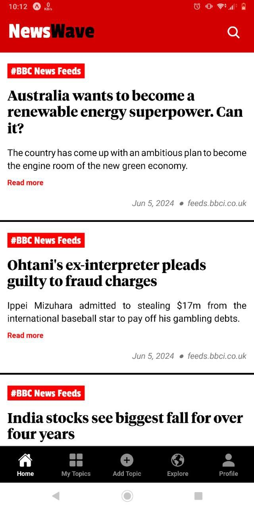
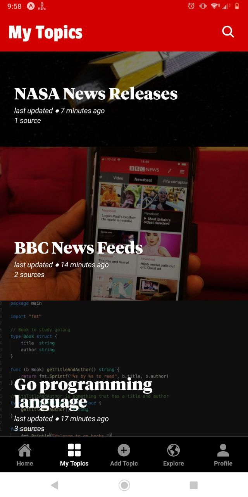
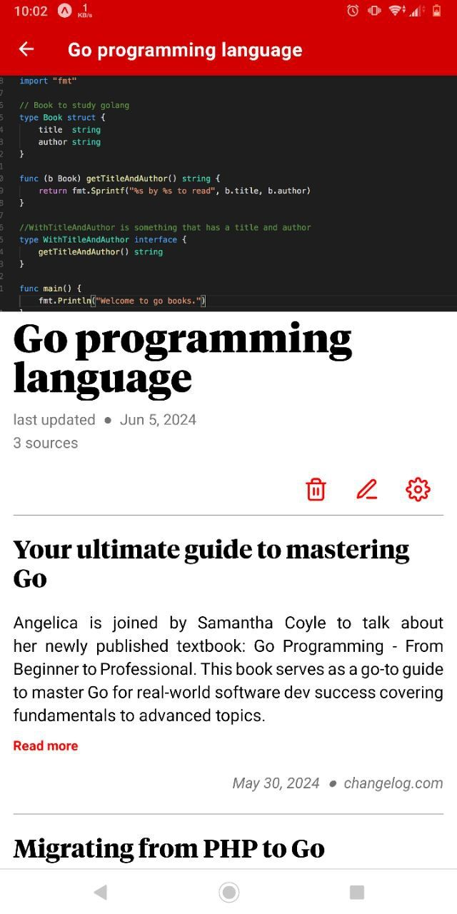
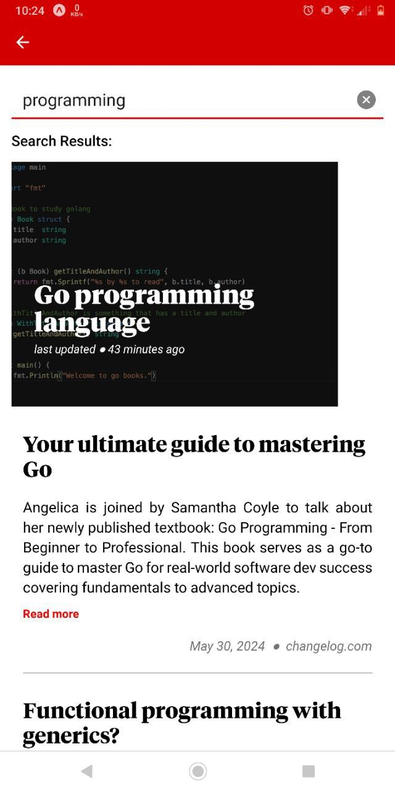
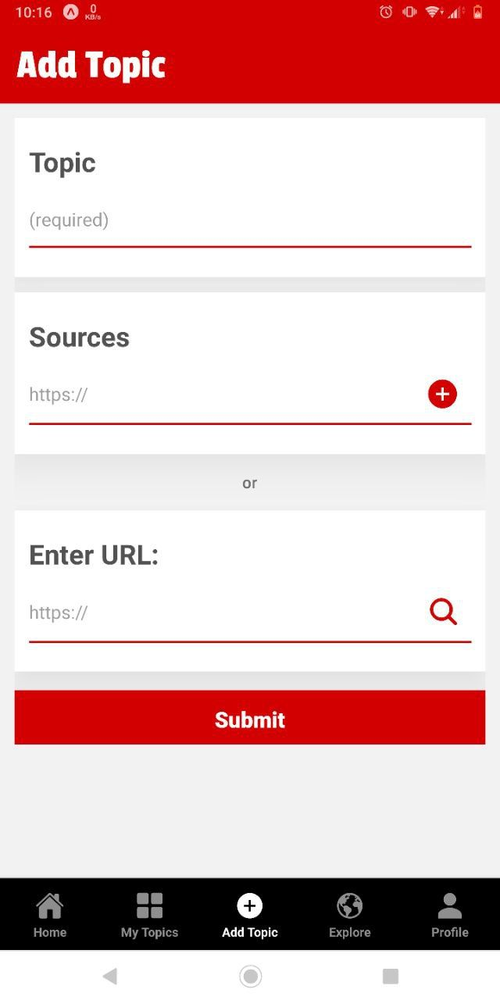
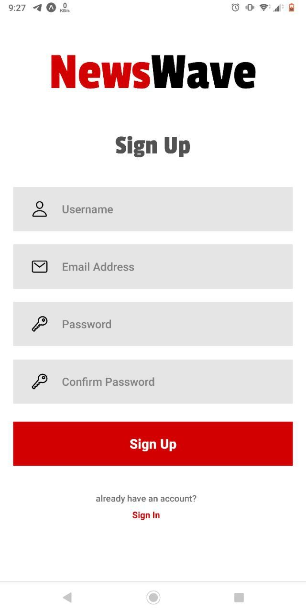
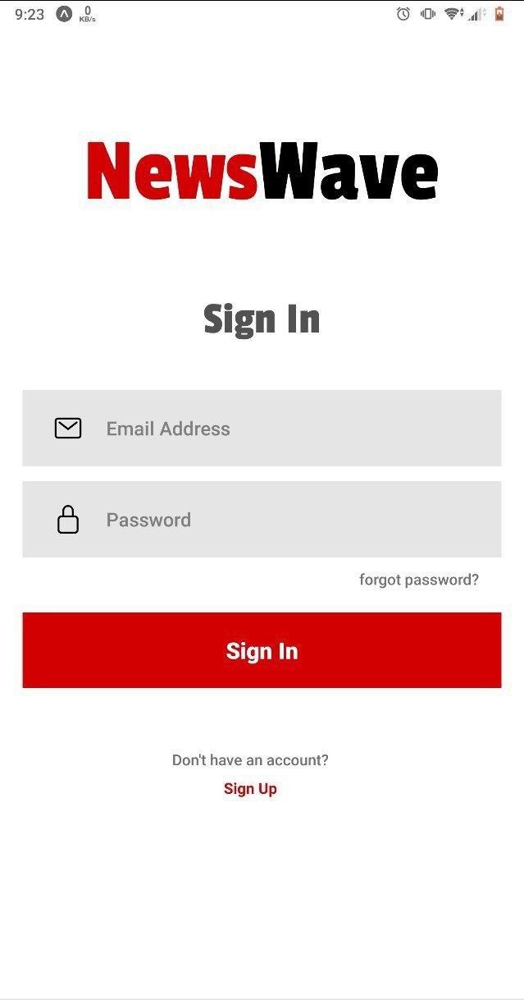

# NewsWave Mobile Application
NewsWave is a mobile application that I've created, which enables users to subscribe to RSS, ATOM, and JSON feeds to keep abreast of the newest updates. Users can categorize the feeds under a specified topic and stay updated.

## Tech stack:
📱 Mobile App:
- React Native
- Expo Router
- Nativewind

📡 Backend:
- Go language (Golang)
- Postgresql

## What did I learn
I found developing with React Native to be quicker, especially with the help of the Expo router for managing app navigation. Nativewind also made styling components much easier than using React Native stylesheets, although there were still some cases where I needed to use a React Native stylesheet.

Go (or Golang) is used to write the HTTP API and Aggregator engine. Go's concurrency patterns make aggregating content from multiple feeds very efficient. The SQLC (a Golang binary) is used to easily handle database queries, and the GOOSE (also a Golang binary) is used to handle database migrations.

## App Interfaces
||||
|:-------------------------:|:-------------------------:|:-------------------------:
 |  |  
 |  | 
